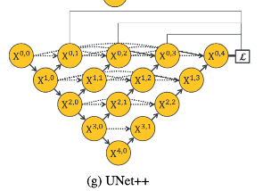
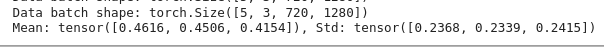

# Mục đích

Cấu trúc thư mục hiện tại mình đang có: 

```text
data_sample/
    im1.png
    im1.json

splitting_datatset_txt/
    test.txt 
    train.txt
    val.txt

scripts/
    xxxs.py
```

Trong đó data_sample sẽ chứa hình ảnh và annotation ở dưới dạng json. 

```text
File: 
    test.txt: 220 records
    train.txt: 905 records
    val.txt: 109 records 

Sum: 1234 records

Folder data_original:
    2484 records: images + json annotations => 1242 records

Redundant: 1242 - 1234 = 8 images
```


- [x] Tìm mối liên hệ giữa hình ảnh và json format. Sau đó tạo ground truth từ chúng xem sao !!! Gợi ý sử dụng file từ scripts á. 

Kết quả đạt được: 

| Original                                        | Sample                                                     | Mask (Power lines)                                        | 
|-------------------------------------------------|------------------------------------------------------------|-----------------------------------------------------------|
|   |   |   | 
|  |  |  |

- [x] Kiểm tra label tạo ra được có đúng chuẩn hay không ? Tức là đọc dữ liệu ra là được bao nhiêu, mình expect là 0, 1. Thực sự thì dữ liệu đọc ra được
là RGB value với line: (255, 255, 255), non-line: (0, 0, 0). Và thông qua phương thức map từ màu sang class trong DataSet của docExtractor thì sẽ chuyển sang
map dạng 0, 1. 

- [x] Tách hình ảnh thành kiểu cấu trúc đơn giản hơn (có thể là tương tự như là đối với DocExtractor vậy, để ta có thể tái sử dụng lại được cái loaddata của nó)


Cấu trúc dữ liệu train của DocExtractor: 

```text
DataSet
    test   
    train 
        seq1_xxxx_Labels.png
        seq1_xxxx.png
    val
        seq16_xxxx_Labels.png
        seq16_xxxx.png
```

Cấu trúc dữ liệu mới được tạo ra từ TTPLA dataset
```text
TTPLA_PreprocesseData
    test 
        04_1234_Labels.png
        04_1234.jpg
    train 
        04_3456_Labels.png
        04_3456.jpg
    val
        04_789_Labels.png
        04_789.jpg
```

- [x] Kiểm tra số lượng hình ảnh tạo ra được, so khớp với số record ở trong mỗi file annotate về json
```text
Test: 440 images -> 220 records
Train: 1810 images -> 905 records
Val: 218 images -> 109 records
```

Vậy là trong dữ liệu dư thừa ra 8 bản ghi không thuộc loại nào, bỏ qua mấy cái đó 

- [x] Xây dựng mô hình cho cái thuật toán PowerLine segmentation. Tìm kiếm model thực hiện tốt điều này. Mình sẽ chọn 
UNET++ (backbone Resnet-34) 



- [x] Xây dựng DataLoader cho segmentation task, kiểm tra chúng.
- [x] Viết script train model.
- [x] Sau khi đẩy dữ liệu full lên trên Drive, thì mình tính toán giá trị trung bình mean và std của toàn bộ dữ liệu trên đó thử:
Kết quả sẽ được note ở đây: 



> Kết quả: 
> * Mean: tensor([0.4616, 0.4506, 0.4154]) 
> * Std: tensor([0.2368, 0.2339, 0.2415])

Tuy nhiên, ta cũng nên thử mean và std từ ImageNet, do ta tái sử dụng lại Resnet pretrained: 
> * Mean: [0.485, 0.456, 0.406]
> * Std: [0.229, 0.224, 0.225]

- [ ] Làm cho quá trình train trở nên `deterministic`